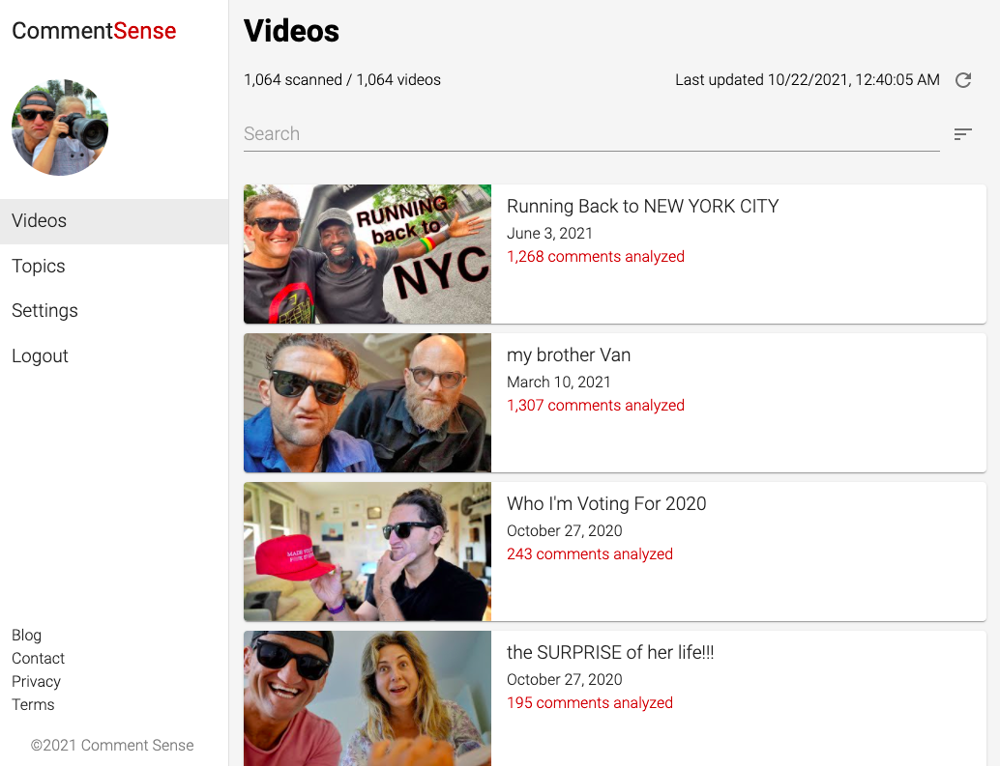
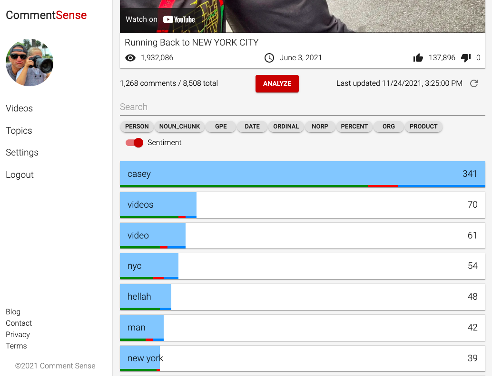

# Comment Sense
Comment Sense is a YouTube comments analytics platform that:
1. Pulls all the comments for videos from your YouTube channel
2. Identifies the most common 'topics', i.e. words and phrases
3. Shows you a list of topics, sorted, and the comments for each

You can view a demo at: http://commentsense.live
(Click on 'Demo' to jump to the app)

## Packages
The following packages and libraries are used:
* Frontend: ReactJS, MaterialUI
* Backend: Flask(Python), MySQL, SpaCy
* Environment: Docker

## Screenshots

